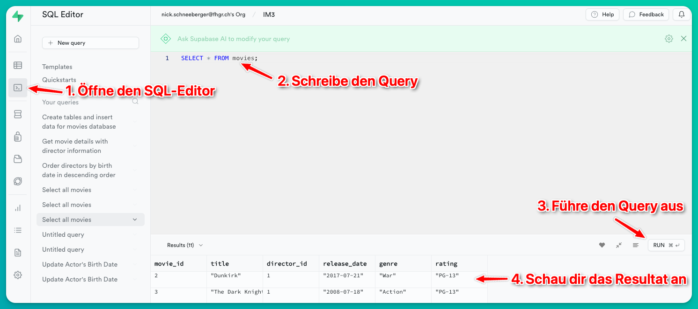
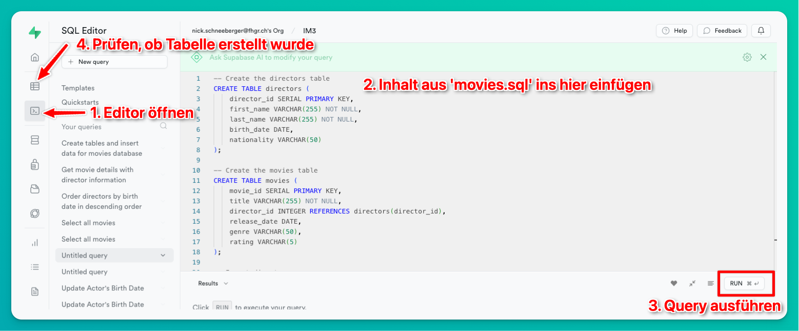

# Supabase SQL Übungen

In diesem Dokument findest du Übungen, um SQL-Operationen (Read, Insert, Update, Delete) zu verstehen und zu üben. Der SQL-Code wird direkt im Supabase-Dashboard geschrieben und nicht in einem HTML bzw. JavaScript-File.

[Link zum Supabase Dashboard](https://app.supabase.io/)

## Datenbankschema

Die Übungen basieren auf einer (kleinen) Film-Datenbank mit Tabellen für Filme, Regisseure, Schauspieler und einer Relationstabelle für Filme und Schauspieler.

- `movies`: Enthält Filmdetails, wobei jeder Film einem Regisseur zugeordnet ist.
- `directors`: Enthält Details zu Filmregisseuren.
- `actors`: Enthält Details zu Filmschauspielenden.
- `movie_actors`: Eine Relationstabelle, die eine many-to-many-Beziehung zwischen Filmen und Schauspielern herstellt.

## Datenbank Importieren

Falls noch nicht geschehen, importiere die [Film-Datenbank](../00_setup/movies.sql) in dein Supabase-Projekt. Kopiere dafür den SQL-Code und füge diesen im `SQL-Editor` im Supabase Dashboard ein.

## Übungen

### Basic

#### Select

1. **Alle Filme abrufen**: Hole alle Spalten aller Filme aus der Tabelle `movies`.
   
2. **Nach Genre filtern**: Rufe alle Filme ab, die dem Genre "Action" gehören.

3. **Ergebnisse sortieren**: Rufe alle Regisseure ab. Ordne sie nach ihrem Geburtsdatum `birth_date` in absteigender Reihenfolge.

4. **Filme zählen**: Ermittle, wie viele Filme Quentin Tarantino gedreht hat.

#### Insert

5. **Schauspieler einfügen**: Füge Rowan Atkinson (06.01.1955, British) in die Tabelle `actors` ein.

6. **Einen neuen Film hinzufügen**: Füge den Film 'The Hateful Eight' von Quentin Tarantino zur Tabelle `movies` hinzu. (Genre: Western, Rating: R, Veröffentlichungsdatum: 25.12.2015)

#### Update

7. **Aktualisierungen**: Ändere das Genre von 'Django Unchained' auf 'Action'.

8. **Regisseur aktualisieren**: Ändere den Namen von 'Quentin Tarantino' auf 'Tentin Quarantino'.

#### Delete

9. **Schauspieler löschen**: Lösche Rowan Atkinson aus der Tabelle `actors`.

### Advanced

10. **Tabellen verknüpfen**: Rufe alle Filme zusammen mit den vollständigen Namen ihrer jeweiligen Regisseure ab.

11. **Mit Verknüpfungen filtern**: Rufe alle Filme ab, die von amerikanischen Regisseuren gedreht wurden.

12. **Datumsoperationen**: Liste alle Filme auf, die vor dem Jahr 2000 veröffentlicht wurden.

13. **LIKE Operator**: Finde alle Regisseure, deren Vorname ODER Nachname mit dem Buchstaben 'C' beginnt.

14. **Aggregation**: Ermittle, wie viele Filme jeder Regisseur gedreht hat, und ordne das Ergebnis nach der Anzahl der Filme in absteigender Reihenfolge.

15. **Case-Anweisungen**: Kategorisiere Filme anhand ihrer Veröffentlichungsdaten (vor 2010 als 'Alt', nach 2010 als 'Neu') und zähle die Anzahl in jeder Kategorie.

## Lösungen
Zu den Lösungen geht es [hier](solution.md).